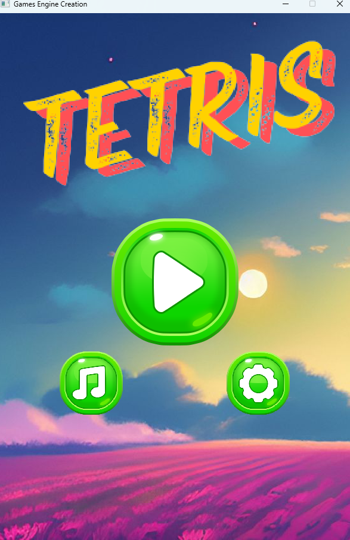
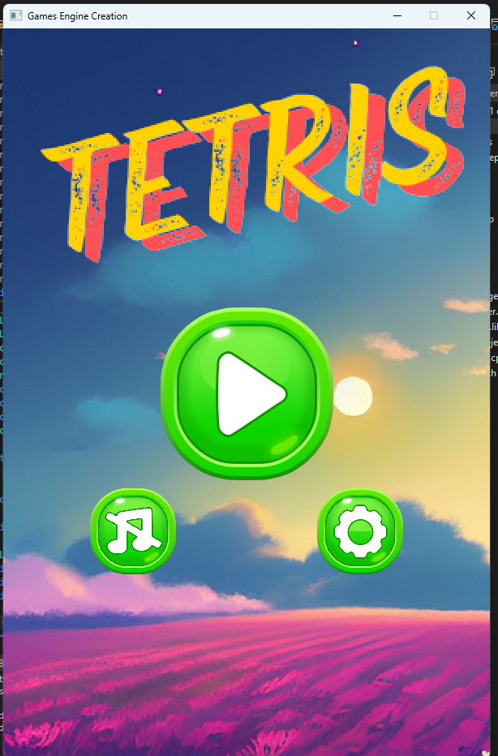
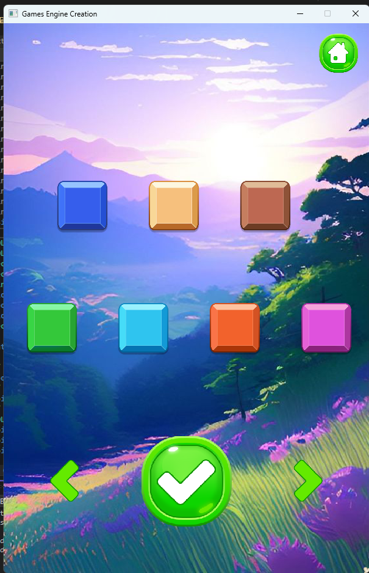
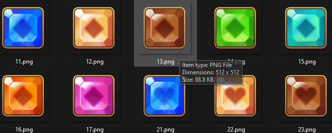

# Tetris

- Sinh viên: Nguyễn Vân Hà
- MSSV: 20020222
  
# Giới thiệu game

- Tetris hay Xếp Hình (1984), trò chơi có 7 loại Khối Hình (Tetromino) I (thẳng đứng), J, L, O (vuông), S, T, Z ứng với 7 màu khác nhau. Mỗi khối sẽ có 1 số điểm, khi xảy ra va chạm giữa các khối hoặc va chạm với biên dưới, sẽ được cộng điểm tương ứng. Ta sẽ điều khiển và xoay các khối để lấy đầy các hàng và phá huỷ chúng. Mục đích sẽ là xếp được nhiều khối nhất trước khi chạm biên trên.
- Link video giới thiệu game: https://drive.google.com/file/d/1CrT21Vp2gaFfIfAMVu7r-MigjuV5IbhK/view?usp=sharing

## Yêu cầu hệ thống

- Hệ điều hành: Windows 10 trở lên
- Phần mềm cần cài đặt: Visual Studio 2022

## Hướng dẫn cài đặt

- Cách 1: Chạy project thông qua Visual Studio 2022

1. Clone repo về máy tính của bạn: git clone https://github.com/havan1279/GameProject_LTNC.git
2. Mở project bằng Visual Studio 2022
3. Mở file `main.cpp`
4. Thực hiện chạy project

- Cách 2: Chạy trực tiếp game thông qua file .exe

1. Clone repo về máy tính của bạn: git clone https://github.com/havan1279/GameProject_LTNC.git
2. Chạy trực tiếp file setup.exe trong mục Debug

# Màn hình game

Màn hình gồm 3 chức năng:

- Chơi game: Khi người chơi click chọn chuyển sang màn hình chơi game

- Bật/tắt nhạc: Khi click vào nút cho phép bật/tắt nhạc
  
- Thay đổi trang phục khối: Khi click vào nút chuyển sang màn hình lựa chọn skin
  

# Cách chơi

- Có 7 loại khối mỗi khối được tạo thành từ các màu giống nhau.
  

1. Người chơi có thể xoay và di chuyển các khối bằng các phím mũi tên: sang trái/phải/xuống và phím mũi tên lên để xoay khối
2. Xếp các khối để tích lũy điểm số
3. Khi các khối lấp đầy một hàng sẽ bị phá hủy và các khối bên trên sẽ rơi xuống để lấp đầy hàng trống. Cố gắng xếp được nhiều khối nhất có thể trước khi có khối va chạm biên trên
4. Khi điểm càng cao tốc độ các khối sẽ rơi càng nhanh
5. Khi khối quá cao bạn sẽ thua cuộc
6. Thay đổi các skin để trông đẹp mắt hơn

# Cấu Trúc Thư Mục

- `Sounds/`: Chứa các tệp âm thanh dùng trong game, định dạng `.wav`.
- `Images/`: Chứa các tệp hình ảnh dùng trong game, định dạng `.png`, `.jpg`.
- `Resources/`: Chứa tệp lưu trữ điểm số của người chơi.
- `SettingProject.h`: Định nghĩa các cấu trúc và thiết lập game.
  - Vector2D: Định nghĩa tọa độ điểm ảnh: x, y
  - Transform: Định nghĩa Transform với thông tin về vị trí, góc xoay, kích thước, độ phóng đại.
  - Mathf: Định nghĩa các phép tính toán toán học.
  - Các enum: `TYPE_IMG`, `TYPE_ICON`, `ID_AUDIO`, `BLOCK_TYPE`.
  - Namespace `SettingProject`: Quản lý các đường dẫn, điểm, trạng thái game.
- `Textures2D.h`:
  - Thuộc tính:
    - màn hình hiển thị
    - thông tin đối tượng
    - biến lưu hình ảnh
    - biến lưu trạng thái
  - Phương thức:
    - Khởi tạo, hủy: constructer, destructer
    - Load hình ảnh
    - Thay đổi độ phóng đại
    - Cập nhật từng frame
    - Hiển thị
- `Mouse.h`: Kế thừa từ `Textures2D.h`
  - Phương thức update cho phép lấy vị trí hiện tại của chuột và show lên màn hình đối tượng chuột tương ứng
- `Button`: Kế thừa từ `Textures2D.h`
  - Thuộc tính bổ sung:
    - Loại btn
    - Trạng thái nổi bật
    - Trạng thái nhấp/nhả
    - Trạng thái chọn
  - Phương thức:
    - Khởi tạo
    - Cập nhật: lấy tọa độ chuột hiện tại
      - Nếu trong vùng btn => thực hiện Hiệu ứng phóng, ngược lại khi thoát khỏi thực hiện scale lại size ban đầu
      - Nếu click: đặt trạng thái choose = true
- `Score.h`:

  - Thuộc tính:
    - Màn hình hiển thị
    - Đối tượng text
    - Danh sách đối tượng hiển thị số
    - Tọa độ
    - Kích thước
  - Phương thức
    - Khởi tạo
    - Cập nhật: tùy vào trường hợp hiển thị đối tượng text đồng thời hiển thị danh sách các đối tượng hiển thị số
    - Thay đổi độ phóng đại: cập nhật toàn bộ độ phóng đại của các kí tự số
    - Cập nhật giá trị hiển thị:
      - Giới hạn giá trị
      - Hủy các đối tượng cũ
      - Chuyển đổi sang chuỗi và tạo các đối tượng mới tương ứng
    - Hủy đối tượng cũ

- `Block.h` kế thừa từ `Textures2D.h`
  - Thuộc tính thêm:
    - Loại màu
    - Level khối: phát triển thêm (khối bị đóng băng phải phá băng lần lượt, ...)
    - Vị trí khối trên ma trận
    - Kích thước khối
    - Vị trí bắt đầu tính
  - Phương thức:
    - Khởi tạo
    - Cập nhật:
      - Nếu kết thúc game thì hiển thị
      - Nếu không hoạt động => kết thúc
      - Nếu độ phóng đại >= 1 và tọa độ y (dòng) trên ma trận < 0 => kết thúc
      - Tính toán vị trí = tọa độ tính + tọa độ trên ma trận _ độ phóng đại _ kích thước thật khối
        Với kích thước thật = kích thước khối - kích thước viền thừa
      - Cập nhật đối tượng
- `Blocks`:
  - Thuộc tính
    - Ma trận tọa độ ứng với các khối
    - Loại khối
    - Danh sách các khối nhỏ
    - Thời gian rơi (thực tế, mặc định)
    - Kiểm tra sự kiện
    - Kiểm tra trạng thái
  - Phương thức
    - Khởi tạo
    - Hủy
    - Tạo khối
    - Kiểm tra va chạm
    - Xoay
    - Cập nhật
    - Di chuyển
    - Chuyển sang khối khác
- `BlockManager`:
  - Thuộc tính:
    - Đối tượng tên
    - Đối tượng khối hiển thị
    - Màn hình hiển thị
    - Vị trí
  - Phương thức:
    - Khởi tạo
    - Cập nhật
    - Tạo khối
- Các hàm khác:

  - bool InitSDL(): Khởi tạo SDL
  - void CloseSDL(): Đóng SDL
  - SDL_Texture\* LoadTextureFromFile(string path): Load đối tượng
  - void InitSoundEffect(): Khởi tạo âm thanh
  - void DisAudio(): Hủy âm thanh
  - void PlayAudio(ID_AUDIO type): Phát âm thanh

  - void DeleteRow(int index): Xóa hàng
  - void CheckMatrix(): Kiểm tra ma trận
  - bool CheckGameOver(): Kiểm tra trạng thái ma trận
  - void Menu(): màn hình menu
  - void SettingMenu(): màn hình setting
  - void PlayGame(): màn hình play
  - void ClearGame(): Làm mới dữ liệu màn chơi
  - vector<Texture2D\*> GetListType(int type, int n = 7): Trả về danh sách các ô màu
  - vector<Score\*> ReadScore(string filename, int score): Trả về danh sách các điểm
 
# Một số tính năng phát triển thêm

## Thuật toán xử lý sinh khối

- B1: Tạo mảng tỉ lệ rơi cho các khối
  float tiLe[] = { 50, 75, 75, 75, 75, 50, 60 };
  - Trong đó lần lượt là các khối: I, O, T, L, J, S, Z
- B2: Tạo giá trị ngẫu nhiên - Tạo giá trị mặc định: result giá trị này sẽ được sử dụng khi quá trình random không - Thực hiện random tối đa 100 lần - random 1 giá trị ngẫu nhiên từ 0-100, và thực hiện so sánh với tỉ lệ sinh các khối => ta được danh sách các khối thỏa mãn - Tiếp tục random trong danh sách các khối đồng thời kiểm tra với 2 khối trước đó, nếu khác thì kết thúc và cập nhật thông tin dữ liệu cho lần sinh khối tiếp theo
  => Thuật toán đảm bảo tỉ lệ 3 khối liên tiếp khác nhau cao, và các loại khối có tỉ lệ rơi nhiều hay ít.

## Thuật toán tăng tốc độ khi điểm tăng

- Với tốc độ delay mỗi frame là 30ms, ta thực hiện giảm thời gian delay thông qua công thức:
  thời gian delay = thời gian delay mặc định \* (1 - score/150);
  với giá trị 1 - score/150 luôn được giới hạn trong phạm vi 0->1
  => Điều này giúp tốc độ game nhanh hơn và giúp người chơi cảm giác độ khó tăng dần.

## Thuật toán hiển thị bảng xếp hạng

- Hàm ReadScore truyền vào đường dẫn file dữ liệu và số diểm người chơi đạt được và trả về danh sách các đối tượng hiển thị điểm (vector Score)
- Các bước thực hiện:
  - Tạo một vector lưu dữ điểm khi đọc từ file (file điểm có điểm số được sắp sếp giảm dần), khi đọc đến phần tử nào ta so sánh với số điểm hiện tại nếu điểm hiện tại lớn hơn diểm đọc từ file tiến hành chèn điểm hiện tại vào vị trí trước điểm đọc từ file và đánh dấu, ngược lại khi dọc hết dữ liệu từ file mà chưa chèn dữ liệu tiến hành chèn vào cuối danh sách.
  - Duyệt vòng lặp qua các đối tượng trong danh sách vừa có tiến hành cập nhật lại dữ liệu trong file và tạo đối tượng score tương ứng và kết thúc.

## Xử lý quản lý skin

- Sử dụng 1 biến tĩnh (file SettingProject.h) lưu trữ vị trí skin mà người dùng chọn, khi load ảnh tùy vào vị trí mà ta sẽ lấy đường dẫn ảnh tương ứng theo công thức: "./Images/" + to_string( (index + 1)\*10 + (vị trí khối tương ứng + 1)) + ".png"
- VD đối với khối I vị trí index 0:
  - Khi người dùng chọn skin 1: đường dãn = "./Images/" + to_string((1+1)\*10 + (0 + 1)) + ".png" = "./Images/21.png"
  - Cho phép lựa chọn và thay đổi skin khối

# Hiển thị icon chuột thay cho chuột mặc định

- Sử dụng hàm SDL_ShowCursor(SDL_DISABLE); để ẩn chuột máy tính
- Thực hiện cập nhật vị trí chuột trùng với vị trí con trỏ transform.position = Vector2D(Mathf::Clamp(e.button.x, 0, SCREEN_WIDTH), Mathf::Clamp(e.button.y, 0, SCREEN_HEIGHT));
  - Trong đó hàm Clamp cho phép giới hạn tọa độ hiển thị.

# Tạo hiệu ứng cho Button

- Khi chuột di chuyển tới tạo hiệu ứng phóng to
- Khi chuột di chuyển ra ngoài vùng tạo hiệu ứng thu nhỏ kích thước về kích thước ban đầu
- Khi click chuột phát âm thanh đồng thời đánh dấu Button đã được click

# Công Nghệ Sử Dụng

- Visual Studio 2022
- C++
- Git

# Tài liệu và nguồn hình ảnh, âm thanh

- Tài liệu: https://www.youtube.com/watch?v=zH_omFPqMO4
- Nguồn hình ảnh:
  - Unity store: https://assetstore.unity.com/packages/2d/gui/icons/puzzle-blocks-icon-pack-278862
  - Itcho: https://moxica.itch.io/tetrominoes
- Nguồn âm thanh:
  - Tiengdong.com https://tiengdong.com/tieng-no-lon
